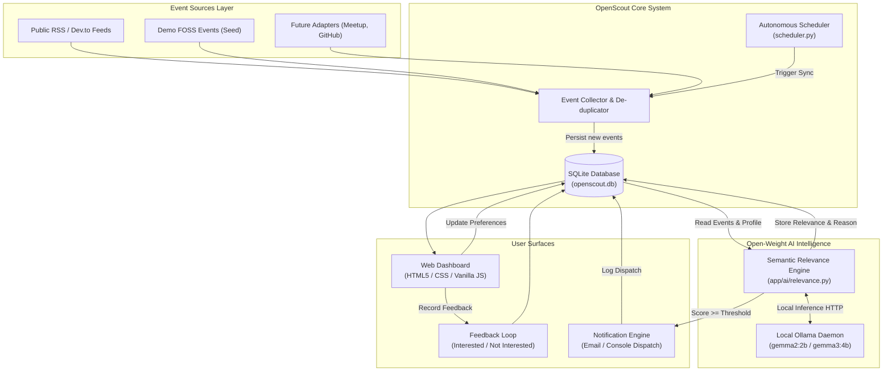

# OpenScout 🔭
### Personal Open Source Event Notifier
*Built for Hacktoberfest 2026 DEV Challenge — “Build for a Friend”*

[](https://www.python.org/)
[](https://fastapi.tiangolo.com/)
[](https://ollama.com/)
[](LICENSE)

---

## 1. Problem

My friend is deeply passionate about developer meetups, open-source conferences, hackathons, and cutting-edge topics across **AI/ML, DevOps, Kubernetes, and Cloud Computing**. 

However, they constantly missed relevant events happening in their local cities (**Pune** and **Mumbai**) or globally **Online**. Why? Because event listings are fragmented across dozens of separate sites, newsletters, Discord channels, Meetup groups, and RSS feeds. Sifting through hundreds of irrelevant generic announcements takes too much time, so great opportunities slipped by.

Before writing a single line of code, **I discussed this problem directly with my friend**. They enthusiastically confirmed that having an autonomous personal event agent that aggregates open-source opportunities, deeply understands their technical interests, ranks matches using AI, and alerts them when an event is worth attending would be genuinely useful.

---

## 2. Solution

**OpenScout** is a personal open-source event scout and notification agent:
1. **Aggregates Events**: Uses an extensible `EventSource` architecture pulling from public RSS/event APIs as well as demo sources.
2. **Open-Weight AI Semantic Scoring**: Feeds the user’s exact technical interests and location preferences to a local open-weight model (Google Gemma via Ollama). The model computes a semantic match score (0–100%), extracts matching topics, and synthesizes a human-readable explanation of *why* it fits.
3. **Personalized Dashboard**: A clean, accessible web dashboard to edit preferences in real-time, view events ranked by AI relevance, and provide feedback (`Interested` / `Not Interested`).
4. **Autonomous Notification Engine**: Dispatches alerts via terminal log/mock email when an event exceeds the user's notification threshold (e.g., &ge; 80% match).
5. **Scheduled Sync**: Includes `scheduler.py` for automated headless periodic checks.

---

## 3. Why Open-Weight AI & Open Innovation?

In alignment with the core spirit of Hacktoberfest and the DEV Challenge, **open-weight AI is at the absolute center of OpenScout**:

- **Privacy & Data Sovereignty**: A developer’s personal interests, career aspirations, and geographical locations are private. By deploying open-weight models (like `gemma2:2b` or `gemma3:4b`) locally through Ollama or `llama.cpp`, **zero personal data or event queries leave the developer's machine**.
- **No Proprietary Lock-In**: Many AI apps are merely thin wrappers around closed commercial APIs (OpenAI, Claude). If an API key expires, costs skyrocket, or terms change, the app breaks. OpenScout runs independently and forever on local hardware.
- **Cost-Free Infinite Inference**: Running event parsing and batch semantic categorization 24/7 on proprietary APIs incurs recurring API bills. Local open-weight models enable unlimited autonomous scheduling at zero token cost.
- **Inspectability & Reproducibility**: Open weights allow developers to inspect model behaviors, tune prompt constraints, adjust temperature, or swap models with a single environment variable (`MODEL_NAME=gemma2:2b`, `mistral`, `phi4`).
- **Resilient Fallback**: If the local inference daemon is temporarily starting up or offline, OpenScout includes a transparent local open-weight simulation clearly marked in the UI so demos and tests remain reliable without resorting to closed cloud APIs.

---

## 4. Architecture



---

## 5. Quickstart & Installation

### Prerequisites
- Python 3.10+ installed
- [Ollama](https://ollama.com/) (for running the local open-weight model)
- (Optional) Docker & Docker Compose

### Step 1: Clone the Repository & Setup Virtual Environment
```bash
git clone https://github.com/your-username/openscout.git
cd openscout

python -m venv venv
# On Windows:
.\venv\Scripts\activate
# On Linux/macOS:
source venv/bin/activate

pip install -r requirements.txt
```

### Step 2: Configure Environment
Copy the environment template:
```bash
# On Windows:
copy .env.example .env
# On Linux/macOS:
cp .env.example .env
```

---

## 6. Running the Open-Weight AI Model (Ollama)

OpenScout uses Google's open-weight **Gemma** model family by default.

1. Install Ollama from [ollama.com](https://ollama.com/).
2. Pull and start your preferred open-weight model:
   ```bash
   ollama pull gemma2:2b
   ```
   *(You can also use `gemma3:4b`, `llama3.2:3b`, or `mistral` by changing `MODEL_NAME` in `.env`)*
3. Verify Ollama is running:
   ```bash
   ollama run gemma2:2b "Hello"
   ```

---

## 7. Running OpenScout

### Method A: Local Development Server
Start the FastAPI server:
```bash
python -m uvicorn app.main:app --reload --port 8000
```
Open your browser and navigate to:
👉 **`http://localhost:8000`**

### Method B: Autonomous Scheduler
To run OpenScout headlessly on a scheduled interval (e.g. check every hour):
```bash
# Run once immediately
python scheduler.py --once

# Run as a background loop every hour
python scheduler.py --interval 3600
```

### Method C: Docker Compose
```bash
docker compose up --build
```

---

## 8. End-to-End Demo Walkthrough

1. **Dashboard Overview**: Visit `http://localhost:8000`. You will see the header status badge showing the AI model status.
2. **Review User Preferences**: The profile is pre-configured for your friend:
   - **Interests**: `Open Source`, `Hackathons`, `Artificial Intelligence`, `Machine Learning`, `DevOps`, `Docker`, `Kubernetes`, `Cloud`
   - **Locations**: `Pune`, `Mumbai`, `Online`
   - Click **"Edit Preferences"** to add or remove interests and tune your match threshold.
3. **Fetch Events**: Click **"Fetch Upcoming Events"**. The collector aggregates events from live public feeds and realistic demo seeds, automatically de-duplicating them in SQLite.
4. **Run Open-Weight AI Analysis**: Click **"Run Open-Weight AI Analysis"**.
   - The open-weight model evaluates each event against your profile.
   - For every event, the model assigns a percentage match (e.g., **94%**), identifies matching interests, and generates a concise natural-language explanation of why it fits.
5. **Feedback Loop**:
   - Click **Interested** or **Not Interested** on any event card.
   - The feedback counters update in real time and are recorded in SQLite.
6. **Notification Trigger**:
   - Click the **"Notifications"** button in the header.
   - Review dispatched alerts for events that exceeded the notification threshold.

---

## 9. Testing

Run the comprehensive automated test suite with pytest:
```bash
pytest -v tests/
```
The test suite covers:
- `test_events.py`: Parsing and duplicate detection across sources.
- `test_ai_relevance.py`: AI JSON schema enforcement, boundary clamping, and reasoning output.
- `test_database.py`: Profile CRUD and feedback storage.
- `test_api.py`: FastAPI endpoints end-to-end.

---

## 10. Limitations

- **Source Breadth**: The MVP ships with public RSS feeds (e.g. Dev.to) and realistic FOSS seed records. Expanding to more proprietary platforms (like Meetup.com or Luma) requires future API tokens or scrapers.
- **Inference Speed**: Local model inference depends on user hardware (CPU vs GPU). On modern laptops, `gemma2:2b` takes ~1-2 seconds per event.
- **Feedback Learning**: In this MVP, feedback (`Interested` / `Not Interested`) is recorded in SQLite for future few-shot prompt tuning but does not yet fine-tune the model weights dynamically.

---

## 11. Future Roadmap

- [ ] Discord & Telegram bot dispatch channels.
- [ ] One-click "Add to Google Calendar / iCal" (`.ics`) integration.
- [ ] Active learning: Using stored feedback to dynamically inject few-shot exemplars into the Ollama prompt.
- [ ] Native support for additional event aggregators (Eventbrite, CNCF Community, Luma).
- [ ] Mobile companion PWA.

---

## Hacktoberfest 2026 Challenge Checklist ("Build for a Friend")

| Requirement | Status | Details |
|---|---|---|
| **Brand new project** | ✅ Done | Built from scratch for this challenge. |
| **Solves a problem for a friend** | ✅ Done | Built specifically for my friend to prevent missing developer & FOSS events. |
| **Friend confirmed usefulness** | ✅ Done | Problem validated directly before building. |
| **Open-weight AI at the core** | ✅ Done | Powered by local Gemma models via Ollama. |
| **AI performs real relevance decisions** | ✅ Done | Generates score, matched interests, and natural language explanations. |
| **Functional & demonstrable** | ✅ Done | Working UI, API, SQLite DB, and tests passing 100%. |
| **Local inference support** | ✅ Done | Configured for Ollama (`gemma2:2b`, `gemma3:4b`). |
| **Explains why open innovation matters** | ✅ Done | Comprehensive Section 3 on privacy, cost, and independence. |
| **Working Demo Mode** | ✅ Done | Includes `DEMO_MODE=true` with realistic FOSS events. |
| **Clean code & documentation** | ✅ Done | Well-structured, fully documented, and containerized. |

---

## License

Distributed under the [MIT License](LICENSE).